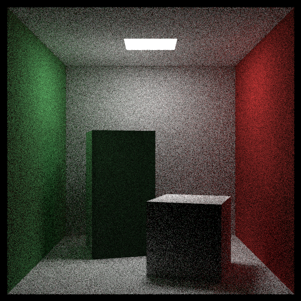
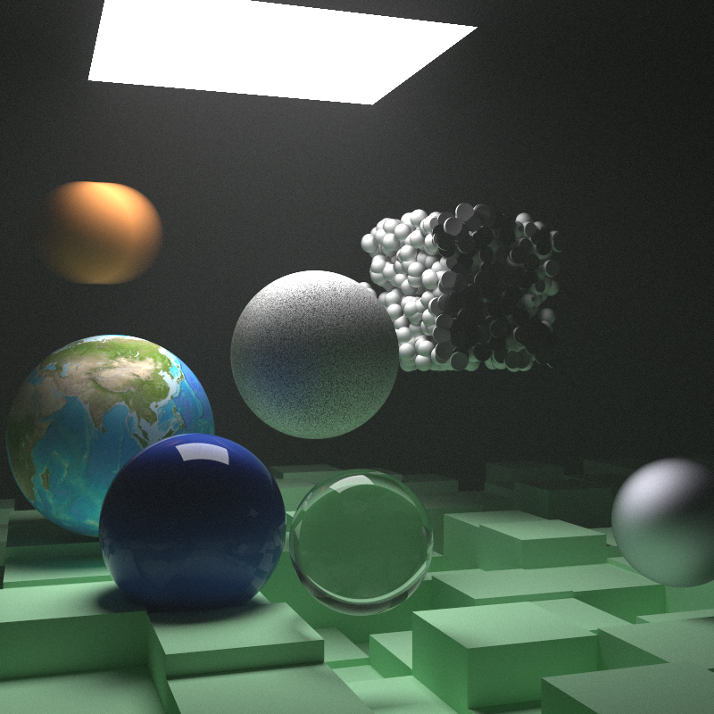

# rttnw
Ray Tracing: The Next Weekend implementation in Rust

## How to run 
1. Install Rust: [Link here](https://www.rust-lang.org/tools/install).
2. Clone repository.
3. Run project 
``` 
cd rttnw 
cargo run --release # List all scenes.
cargo run --release -- <scene> # Run a scene.
```

## Images



## Ray Tracing in One Weekend
Implementation here: https://github.com/luliic2/rtiow
